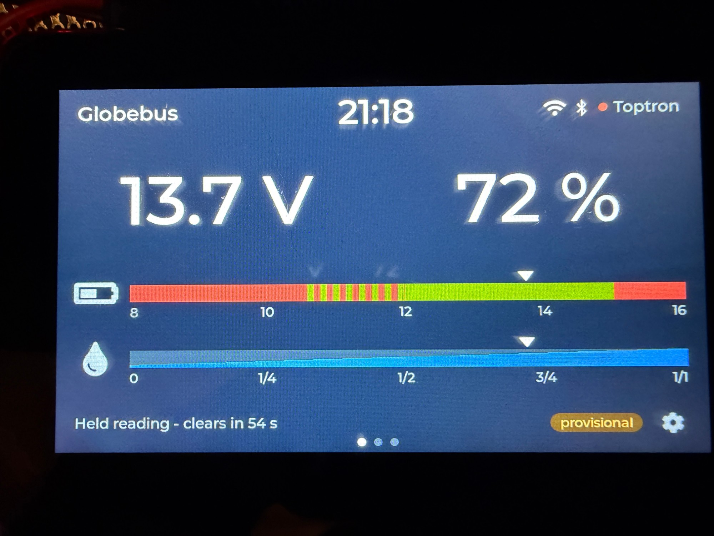
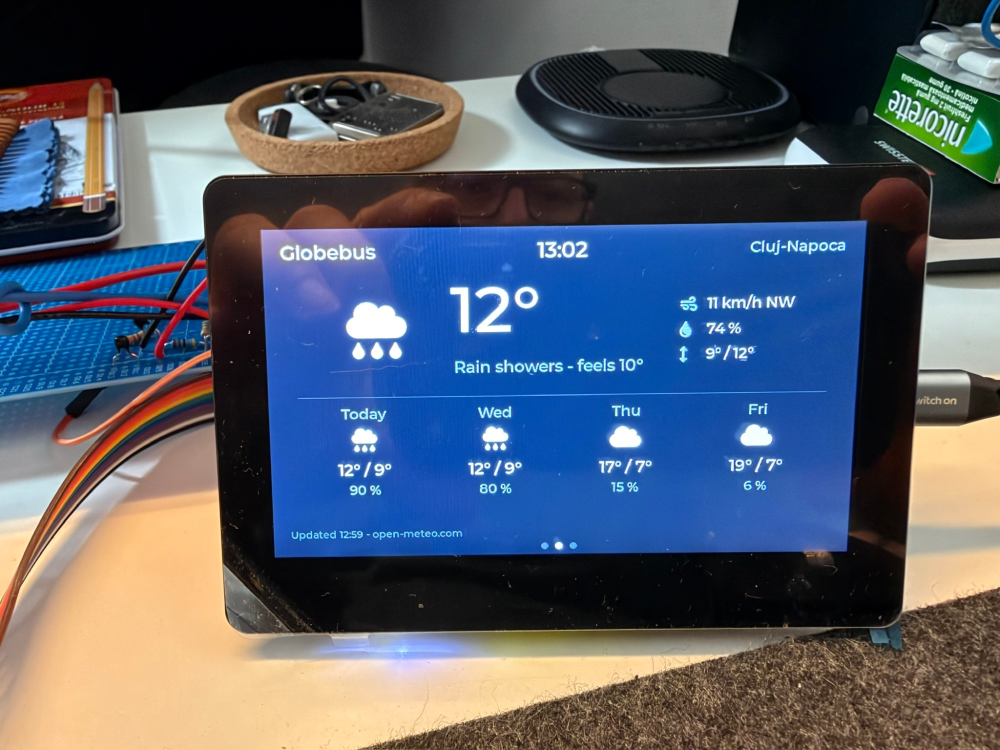
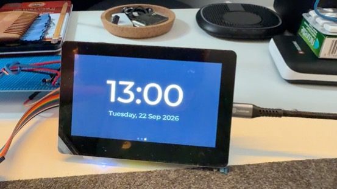
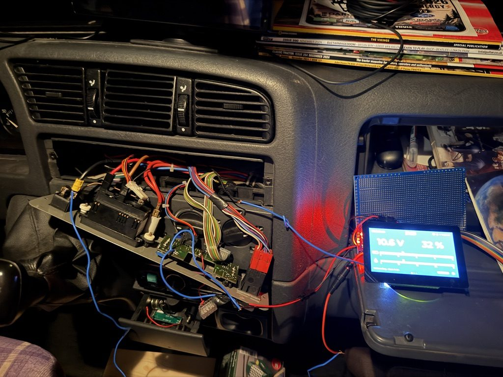

# Globebus panel

A touchscreen control panel for a Dethleffs Globebus motorhome, built around a Waveshare
ESP32-S3-Touch-LCD-4.3B. It reads the van's original Toptron TCP MC2 panel and shows what its single
analogue gauge used to show — battery voltage and tank levels — plus a clock and the weather.

The original electronics stay exactly as they are. Nothing in the van is modified, cut or re-wired:
the panel reads the same signal the old gauge was driven by, through the same load the gauge presented.



| | |
|---|---|
|  |  |

## Why it is built this way

The interesting part of this project was not the display — it was working out what the Toptron
actually does, because none of it was documented:

- **The gauge output only exists while a selector is held.** The rockers on the panel are momentary;
  with nothing pressed the output floats. There is no value to read at rest.
- **It is a current drive for a moving-coil gauge, not a voltage source.** Open-circuit readings drift
  and are meaningless, which is why early measurements never repeated. The panel therefore presents
  a burden resistor of the same value as the original gauge (85.8 Ω measured) and reads the voltage
  across it.
- **One needle, two scales.** The original dial carries 8–16 V on top and 0–1/1 below, perfectly
  aligned. So a single battery calibration yields the tank percentage as well: `% = (V − 8) / 8`.
- **The panel cannot tell which selector is held**, and the value ranges overlap, so every press is
  shown both as volts and as percent. The person pressing knows which one they wanted.
- **The Toptron's ground is not the vehicle's ground.** It sits up to 0.3 V above battery negative
  under load, so the measurement is taken differentially against the gauge's own signal ground.

Each of these came from measurements, several of them after a wrong assumption was disproved.

## What it does

- **Three pages**, swipe to change: gauges, weather, a big clock with the date.
- **Gauges:** volts and percent side by side, with the original dial's colour zones and its water
  wedge; the marker sits at the same position on both scales, like the old needle. Values in the
  dial's red zones turn red.
- **Weather:** current conditions and a four-day forecast from [open-meteo](https://open-meteo.com)
  (no account, no API key), located by IP address or by a place you set.
- **Clock:** kept by the board's RTC and set from the internet when Wi-Fi is available.
- **Settings:** clock, Wi-Fi (scan, on-screen keyboard), Bluetooth, weather location, display
  timeout, and a diagnostics page with the raw measurements.
- **Display timeout:** the screen blanks and the backlight switches off after a chosen time; a touch
  or a selector press wakes it. The image is blanked, not just darkened, because an LCD showing a
  static picture in the dark still suffers image retention.

## Hardware

| Part | Notes |
|---|---|
| Waveshare ESP32-S3-Touch-LCD-4.3B | 800×480 RGB, GT911 touch, CH422G IO expander, PCF85063 RTC, 7–36 V input |
| ADS1115 | 16-bit ADC, differential, on the display board's I²C bus |
| Burden resistor | ~86 Ω, the load the original gauge presented |
| RC filter | 4.7 kΩ + 100 nF on each ADC input |

The panel is powered from the van's permanent 12 V through its own 1 A fuse, with its ground on a
separate wire so its return current never flows through the Toptron's ground.

## Software

PlatformIO with the pioarduino platform (Arduino-ESP32 3.1.1) and LVGL 8.4.

- `src/main.cpp` — measurement, the three pages, settings, RTC, display timeout
- `src/net.{h,cpp}` — Wi-Fi, NTP, weather and BLE, on their own task on the second core so network
  waits never disturb the sampling
- `src/fonts/` — fonts generated with `lv_font_conv` from the fonts bundled with LVGL
- `stages/` — the working firmware from each build stage, kept for reference

```bash
pio run              # build
pio run -t upload    # flash over USB
```

## Status

Bench-verified and tested live in the dash: all four channels read, the interface and the network features run. Final installation in the van is pending.



Still to do: connect to an EcoFlow power station over BLE.

## Licence

MIT — see [LICENSE](LICENSE).
